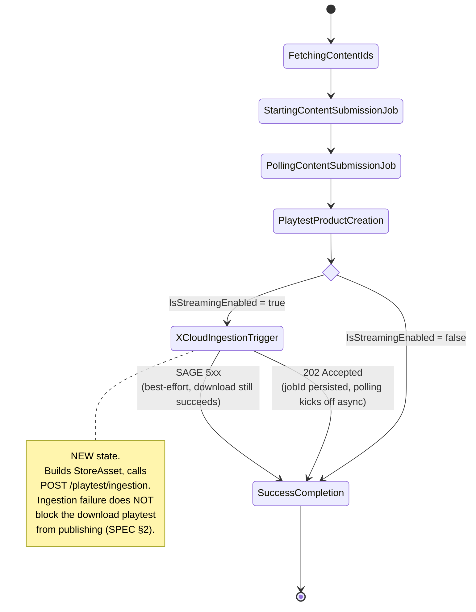
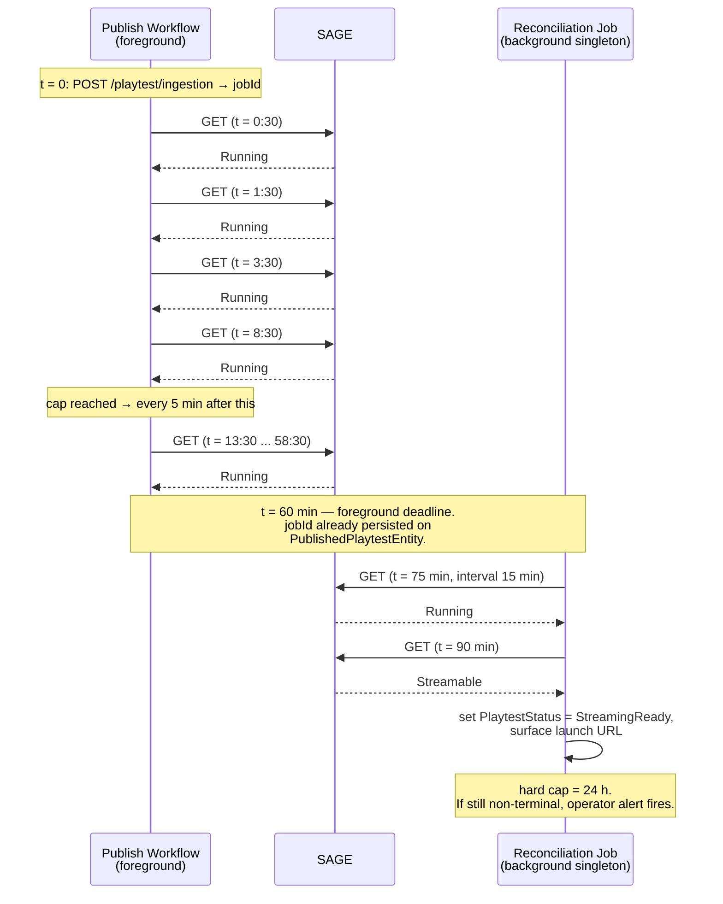
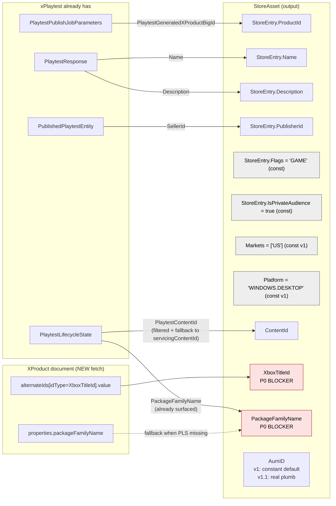
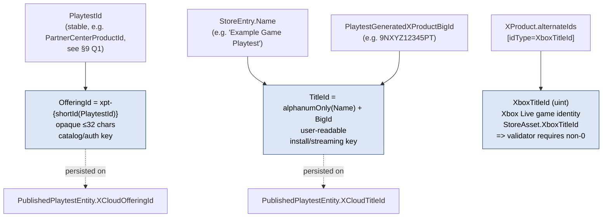
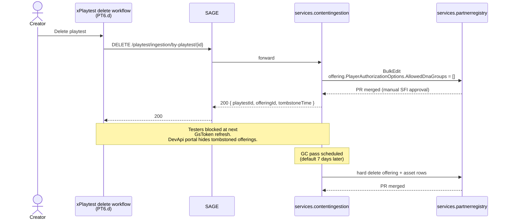
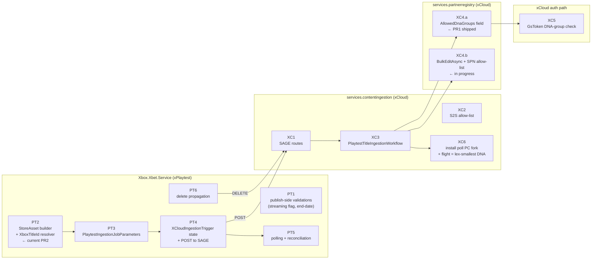

# Diagrams — Instantly Shareable Playtest

Visual companions to [`SPEC.md`](./SPEC.md). All diagrams are GitHub-flavored Mermaid (renders natively in ADO, GitHub, and most Markdown previewers).

Each diagram cites the SPEC section it visualizes so it stays auditable when the spec changes.

---

## 1. System Context — who talks to whom (SPEC §2, §3.1, §3.7, §6)

Shows the four services involved and the *direction* of each call. xPlaytest never speaks to anything inside xCloud directly — every cross-tenant hop goes through SAGE.

```mermaid
flowchart LR
    PC["Partner Center UI<br/>(creator)"]
    XPT["xPlaytest<br/>(MSFTGreen tenant)"]
    SAGE["SAGE<br/>(cross-tenant proxy)"]
    CI["services.contentingestion<br/>(xCloud)"]
    PR["services.partnerregistry<br/>(xCloud)"]
    SUCU["SUCU / install pipeline<br/>(xCloud)"]

    PC -->|Publish<br/>(Enable Cloud Streaming ✓)| XPT
    XPT -->|POST /playtest/ingestion<br/>(S2S bearer)| SAGE
    XPT -->|GET /playtest/ingestion/{jobId}<br/>poll, exp backoff| SAGE
    XPT -->|DELETE /playtest/ingestion/by-playtest/{id}<br/>on playtest delete| SAGE
    SAGE -->|/v3/workflows/playtestingestion| CI
    CI -->|BulkEditAsync<br/>(offering write + title attach<br/>in one ADO PR)| PR
    CI -->|PollFirstInstall<br/>(flight = lex-smallest DNA group)| SUCU

    classDef green fill:#dff2d8,stroke:#3a7d2c,color:#000
    classDef corp fill:#dde6f5,stroke:#2a4a7a,color:#000
    classDef edge fill:#fff6d8,stroke:#a07a00,color:#000
    class XPT green
    class CI,PR,SUCU corp
    class SAGE edge
```

**Tenant boundary:** xPlaytest (green) is in the MSFTGreen tenant; xCloud services (blue) are in Corp/PME. SAGE (yellow) is the only cross-tenant hop and is the auth gate (`AuthorizedClientAppIds` allow-list per route, SPEC §3.7 / Known Blockers §7).

---

## 2. End-to-End Happy Path — sequence (SPEC §2 phases 1–4)

The four phases the user sees from "click Publish" to "playtest is streamable."

```mermaid
sequenceDiagram
    autonumber
    actor Creator
    participant XPT as xPlaytest<br/>(XPackagePlaytestPublishWorkflow)
    participant SAGE
    participant CI as services.contentingestion<br/>(PlaytestTitleIngestionWorkflow)
    participant PR as services.partnerregistry
    participant SUCU as Install pipeline

    Creator->>XPT: Publish (Enable Cloud Streaming = true,<br/>PlaytestEndDate = required)
    Note over XPT: existing states:<br/>FetchingContentIds → StartingContentSubmissionJob<br/>→ PollingContentSubmissionJob → PlaytestProductCreation
    Note over XPT: NEW state: XCloudIngestionTrigger

    XPT->>XPT: Build StoreAsset<br/>(XboxTitleId from XProduct alternateIds)
    XPT->>SAGE: POST /playtest/ingestion<br/>(PlaytestIngestionJobParameters)
    SAGE->>CI: forward /v3/workflows/playtestingestion
    CI-->>SAGE: 202 Accepted { jobId, statusUrl }
    SAGE-->>XPT: 202 Accepted

    XPT->>XPT: persist XCloudIngestionJobId<br/>on PublishedPlaytestEntity
    Note over XPT: download-only path completes here<br/>(streaming is best-effort)

    par xCloud ingestion (async)
        CI->>CI: validate PlaytestIngestionJobParameters
        CI->>CI: AssetIngestionWorkflow<br/>(no BigCat lookup; uses StoreAsset)
        CI->>PR: BulkEditAsync<br/>(offering xpt-{shortId} + title attach,<br/>AllowedDnaGroups, ExpirationTime, RETAIL sandbox)
        PR-->>CI: PR merged (manual SFI approval)
        CI->>SUCU: PollFirstInstall<br/>(flight = lex-smallest DNA group GUID)
        SUCU-->>CI: install available
    and xPlaytest polling (exp backoff)
        loop until terminal or 60 min foreground
            XPT->>SAGE: GET /playtest/ingestion/{jobId}
            SAGE->>CI: forward
            CI-->>SAGE: { status: Running | Streamable | Failed | InstallNotFound }
            SAGE-->>XPT: status
        end
    end

    XPT->>XPT: PlaytestStatus = StreamingReady<br/>(new enum value)
    XPT-->>Creator: launch URL<br/>https://play.xbox.com/play/launch/{productId}?offeringId=xpt-{id}
```

**Note on parallelism:** the xCloud ingestion and xPlaytest polling run concurrently (the `par … and …` block). xCloud is not waiting for xPlaytest to poll — it's making progress independently and xPlaytest is just observing.

---

## 3. xPlaytest Publish State Machine — where the new state slots in (SPEC §2 phase 1)

Visualizes the existing state machine and the **single insertion point** for streaming. Everything before `PlaytestProductCreation` is unchanged.



---

## 4. Polling Backoff Timeline (SPEC §3.1)

What "poll until terminal" actually looks like over wall-clock time. The handoff at 60 min from foreground polling to the background reconciliation job is the key reliability mechanism — without it, slow ingestion ( >60 min) silently drops the offering.



| Window | Source | Interval | Cap |
|---|---|---|---|
| 0 → 60 min | foreground publish workflow | 30s → 60s → 2m → 5m (cap) | 60 min wall clock |
| 60 min → 24 h | background reconciliation job | 15 min | 24 h, then alert |

---

## 5. StoreAsset Construction — where each field comes from (SPEC §5.2)

The dependency map for the StoreAsset the xPlaytest workflow has to build. The **red boxes are the P0 blockers** that don't have a source today.



> **PR2 in `Xbox.Xbet.Service` resolves the red `XboxTitleId` blocker.** Today `PlaytestProductDocumentBuilder.cs:53-70` hardcodes empty; the new `XboxTitleIdResolver` pulls from `alternateIds[idType=XboxTitleId]`. See SPEC §5.2 row "XboxTitleId" and Known Blockers §7.

---

## 6. Identifier Lattice — `OfferingId` vs `TitleId` vs `XboxTitleId` (SPEC §5.3)

Three values that all sound similar and are NOT interchangeable. This is the most common confusion when reading the spec.



| Identifier | Owner | Derived from | Locked? | Purpose |
|---|---|---|---|---|
| `OfferingId` | xCloud derives, xPlaytest persists | `xpt-{shortId(PlaytestId)}` | Yes, for the lifetime of the playtest | Catalog/auth — the key SAGE + PartnerRegistry use |
| `TitleId` | xCloud derives, xPlaytest persists | `alphanumOnly(Name)+PlaytestGeneratedXProductBigId` | Yes once created — rename only updates display (§9 Q4) | User-facing install/streaming key |
| `XboxTitleId` | xPlaytest reads from XProduct, passes through | XProduct `alternateIds[idType=XboxTitleId]` | n/a — game-level identity that long pre-dates the playtest | StoreAsset validator requirement for games |

---

## 7. Delete Flow — tombstone, not hard delete (SPEC §6.2.1, §7, §8)



**Why tombstone not hard delete:** the formal project description says "delete = fully cleaned up." We deliver the user-visible behavior (offering disappears, testers blocked) immediately. The actual hard-delete PR runs 7 days later. This is a **scoped deviation** that needs explicit Anthony/Brian sign-off — see SPEC §7 row "Delete model = tombstone."

---

## 8. PR / Workstream Ownership Map (SPEC §4, ADO/ado-tasks.md)



The dependency chain visualizes why the small in-flight PRs are sequenced: PT2 (resolver) unblocks PT3 (payload), PT3 unblocks PT4 (trigger), PT4 + XC1 close the cross-tenant loop, and so on.
